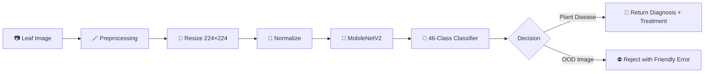
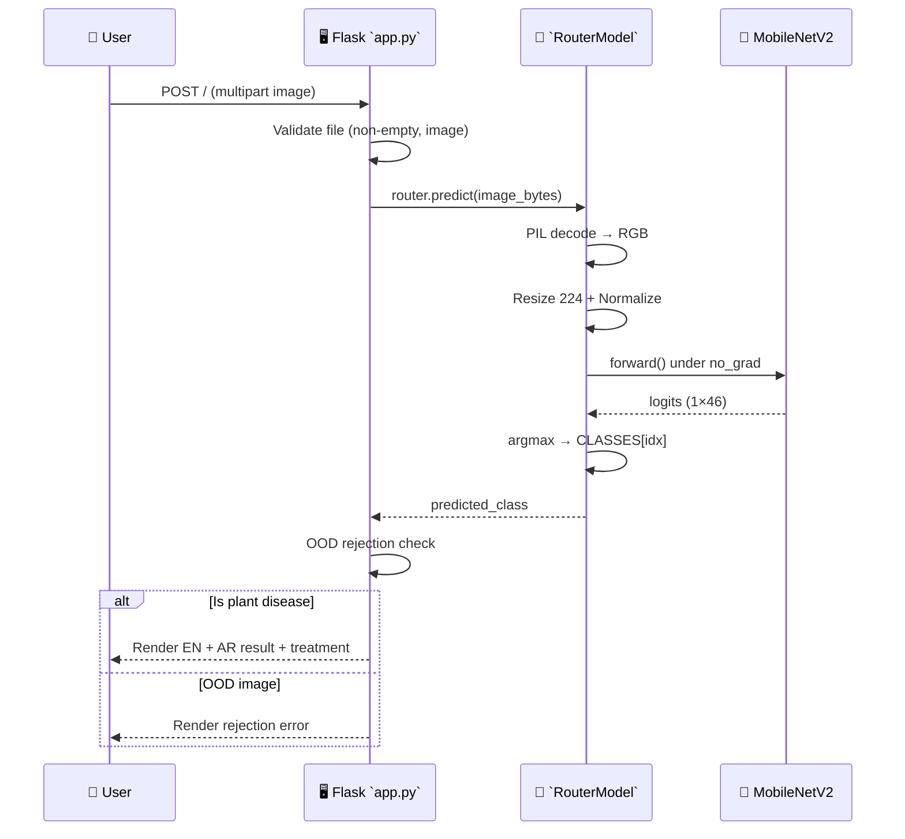
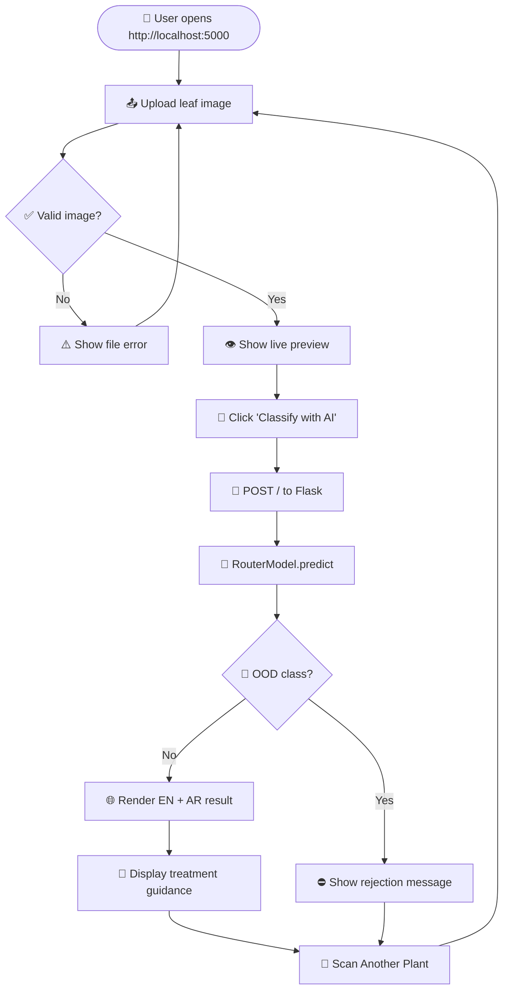

<div align="center">


# 🌿 AgroSense — Plant Village Disease Classification

### *Diagnose crop diseases in seconds — directly from a leaf photo.*

A deep-learning powered web application that classifies **38 plant diseases across 14 crops** using a fine-tuned **MobileNetV2** backbone, served through a lightweight **Flask** web UI with bilingual (English / Arabic) treatment guidance.

[](https://www.python.org/)
[](https://pytorch.org/)
[](https://www.tensorflow.org/)
[](https://flask.palletsprojects.com/)
[](https://keras.io/)
[](LICENSE)
[](#-tech-stack)
[](#-author)

<br/>

[**🚀 Demo**](#-demo--screenshots) · [**📦 Quick Start**](#-quick-start) · [**🧠 Architecture**](#-architecture) · [**🛣️ Roadmap**](#-roadmap) · [**🤝 Contribute**](#-contributing)

</div>

---

## 📑 Table of Contents

* [✨ Overview](#-overview)
* [🚀 Features](#-features)
* [🧠 AI Architecture](#-ai-architecture)
* [📂 Repository Structure](#-repository-structure)
* [⚙️ Tech Stack](#-tech-stack)
* [📦 Quick Start](#-quick-start)
* [🖥️ Application Flow](#-application-flow)
* [🌐 API Reference](#-api-reference)
* [🔐 Configuration & Environment](#-configuration--environment)
* [🐳 Docker Deployment](#-docker-deployment)
* [📊 Performance Highlights](#-performance-highlights)
* [🛡️ Security & Validation](#-security--validation)
* [🖼️ Demo & Screenshots](#-demo--screenshots)
* [🧪 Testing & Validation](#-testing--validation)
* [🤝 Contributing](#-contributing)
* [🛣️ Roadmap](#-roadmap)
* [📜 License](#-license)
* [👨‍💻 Author](#-author)

---

## ✨ Overview

<table>
<tr>
<td width="65%" valign="top">

**AgroSense** is a precision-agriculture tool that brings state-of-the-art computer vision to the field. Built on the **PlantVillage** benchmark dataset, it lets a farmer, agronomist, or hobbyist gardener snap a leaf photo and instantly receive:

* **Crop identification** (Apple, Tomato, Grape, Corn, Potato …)
* **Disease diagnosis** (Early Blight, Late Blight, Scab, Black Rot, …)
* **Confidence-aware predictions** with out-of-domain rejection
* **Bilingual treatment guidance** (English + Arabic)

The system is trained to recognize **38 plant disease categories** spanning **14 crops**, while an additional **8-class out-of-domain detector** prevents misclassification on irrelevant images (cars, animals, etc.).

</td>
<td width="35%" valign="top">

### 🎯 Why AgroSense?

| Pain Point | AgroSense Solution |
|---|---|
| Slow expert diagnosis | Inference in **< 200 ms** |
| Language barriers | Bilingual EN / AR guidance |
| Generic AI hallucination | Hard rejection of OOD inputs |
| Heavy models | MobileNetV2 backbone |
| Complex deployment | Single Flask + PyTorch stack |

</td>
</tr>
</table>

---

## 🚀 Features

<div align="center">

### 🧠 AI & Machine Learning

</div>

| Feature | Description |
|---|---|
| 🎯 **46-Class Classifier** | 38 disease classes + 8 out-of-domain rejection classes |
| 🦾 **MobileNetV2 Backbone** | Lightweight architecture optimized for CPU & GPU inference |
| 🔁 **Combined Model Strategy** | Merges plant-disease expert + natural-image rejection head into one unified model |
| 🎨 **ImageNet Normalization** | Standardized `mean / std` preprocessing for stable predictions |
| 📐 **224×224 Input Pipeline** | Resize + Normalize transform pipeline via `torchvision` |
| ⚡ **Single-Shot Inference** | `model.eval()` + `torch.no_grad()` for production latency |

<div align="center">

### 🌐 Web Application

</div>

| Feature | Description |
|---|---|
| 🖼️ **Drag & Drop Upload** | Modern HTML5 drop zone with file-type validation |
| 👁️ **Live Image Preview** | Client-side preview before server round-trip |
| 🌍 **Bilingual Results** | Side-by-side English + Arabic (RTL) result panels |
| 💊 **Treatment Guidance** | Curated treatment advice per known class |
| ⚠️ **Hard OOD Rejection** | Server-side filter against non-plant classes |
| 📱 **Responsive UI** | Mobile-first layout with adaptive grids |
| 🟢 **Health Checks** | Auto-scroll to result/error blocks for better UX |

<div align="center">

### 🛠️ Engineering & DevOps

</div>

| Feature | Description |
|---|---|
| 🧩 **Modular Architecture** | Clean separation: `app.py` (Flask) ↔ `router_model.py` (inference) |
| 📓 **Reproducible Training** | Full Keras/TensorFlow training pipeline in notebook |
| 🧪 **Filter Notebook** | Auxiliary preprocessing & dataset-curation notebook |
| 🔥 **CUDA Acceleration** | Automatic GPU detection with safe CPU fallback |
| 🐳 **Containerization-Ready** | Minimal dependencies → trivial Docker packaging |
| 🗂️ **Sample Disease Library** | 38 reference images in `Disease_Samples/` for testing |

---

## 🧠 AI Architecture

### 🦾 Model Stack



### 🧬 Model Architecture — `combined_model.pth`

The deployed model uses a **fine-tuned MobileNetV2** with a custom classification head:

| Component | Specification |
|---|---|
| **Backbone** | `torchvision.models.mobilenet_v2(weights=None)` |
| **Input Shape** | `(3, 224, 224)` |
| **Classifier Head** | `nn.Linear(last_channel, 46)` |
| **Output Classes** | 38 Plant Diseases + 8 OOD Rejection |
| **Total Classes** | 46 |
| **State Dict** | Loaded from `combined_model.pth` |
| **Inference Mode** | `model.eval()` + `torch.no_grad()` |
| **Device Support** | Auto CUDA / CPU fallback |

### 🧪 Training Pipeline

The training pipeline (see `plant-village-disease-classification-using-cnn.ipynb`) covers:

| Stage | Tooling |
|---|---|
| **Dataset** | PlantVillage Color (38 classes) |
| **Split** | 80% Train / 10% Validation / 10% Test (stratified) |
| **Augmentation** | `ImageDataGenerator` with horizontal flip |
| **Architecture** | Custom Sequential CNN (Conv2D → MaxPool stacks) |
| **Loss** | `categorical_crossentropy` |
| **Optimizer** | Adam |
| **Metrics** | Accuracy + AUC |
| **Callbacks** | `ModelCheckpoint` + `EarlyStopping(patience=5)` |
| **Export** | Knowledge distilled → MobileNetV2 (`combined_model.pth`) |

### 🔄 Inference Pipeline



### 🌿 Supported Classes (PlantVillage — 38)

<details>
<summary>📋 Click to expand the full class list</summary>

<br/>

| Crop | Classes |
|---|---|
| 🍎 **Apple** | Apple Scab · Black Rot · Cedar Apple Rust · Healthy |
| 🫐 **Blueberry** | Healthy |
| 🍒 **Cherry** | Powdery Mildew · Healthy |
| 🌽 **Corn (Maize)** | Cercospora Leaf Spot · Common Rust · Northern Leaf Blight · Healthy |
| 🍇 **Grape** | Black Rot · Esca (Black Measles) · Leaf Blight · Healthy |
| 🍊 **Orange** | Huanglongbing (Citrus Greening) |
| 🍑 **Peach** | Bacterial Spot · Healthy |
| 🫑 **Pepper, Bell** | Bacterial Spot · Healthy |
| 🥔 **Potato** | Early Blight · Late Blight · Healthy |
| 🫐 **Raspberry** | Healthy |
| 🫘 **Soybean** | Healthy |
| 🎃 **Squash** | Powdery Mildew |
| 🍓 **Strawberry** | Leaf Scorch · Healthy |
| 🍅 **Tomato** | Bacterial Spot · Early Blight · Late Blight · Leaf Mold · Septoria Leaf Spot · Spider Mites · Target Spot · Yellow Leaf Curl Virus · Mosaic Virus · Healthy |

</details>

### ⛔ Out-of-Domain Rejection Classes (8)

| Class | Purpose |
|---|---|
| ✈️ `airplane` | Prevent false positives on non-plant imagery |
| 🚗 `car` | Prevent false positives on non-plant imagery |
| 🐱 `cat` | Prevent false positives on animals |
| 🐶 `dog` | Prevent false positives on animals |
| 🌸 `flower` | Disambiguate ornamental from crop leaves |
| 🍎 `fruit` | Disambiguate produce from leaves |
| 🏍️ `motorbike` | Prevent false positives on vehicles |
| 🧍 `person` | Prevent false positives on humans |

---

## 📂 Repository Structure

```bash id="repo-tree"
plant-village-disease-classification/
├── 🐍 app.py                      # Flask web server & routes
├── 🧠 router_model.py             # MobileNetV2 inference wrapper (RouterModel)
├── 🤖 combined_model.pth          # Trained PyTorch model (46 classes)
├── 📓 plant-village-disease-classification-using-cnn.ipynb   # Training notebook (Keras/TF)
├── 🪄 Filter.ipynb                # Data filtering & preprocessing notebook
│
├── 🖼️ templates/
│   └── 🌐 index.html              # Bilingual EN/AR upload UI
│
├── 🎨 static/
│   └── 💅 style.css               # Premium green-themed responsive CSS
│
├── 🧪 Disease_Samples/            # 38 sample leaf images (one per class)
│   ├── 🍎 Apple___Apple_scab.jpg
│   ├── 🍅 Tomato___Late_blight.jpg
│   ├── 🥔 Potato___Early_blight.jpg
│   └── ... (38 reference images)
│
├── 🖼️ Apple_Scab.png              # README reference assets
├── 🖼️ apple_health.png            # README hero banner
├── 🖼️ Scab.jpg                    # README reference asset
├── 🖼️ OIP.png                     # README reference asset
│
└── 📜 README.md                    # You are here ✨
```

---

## ⚙️ Tech Stack

### 🎨 Frontend

| Technology | Purpose |
|---|---|
| **HTML5** | Semantic page structure with Jinja2 templating |
| **CSS3** | Custom design tokens, glassmorphism cards, gradient hero |
| **Vanilla JavaScript** | Drag-and-drop, file preview, smooth scroll UX |
| **Responsive Grid** | Mobile-first layout (single column < 900px) |

### 🖥️ Backend

| Technology | Purpose |
|---|---|
| **Flask 3.x** | Lightweight WSGI server for inference API |
| **Jinja2** | Server-side rendering for result panels |
| **Python 3.9+** | Application runtime |

### 🧠 AI / ML

| Technology | Purpose |
|---|---|
| **PyTorch 2.x** | Inference engine for the deployed MobileNetV2 |
| **Torchvision** | Pretrained backbone + standard image transforms |
| **Pillow (PIL)** | Image decoding from in-memory bytes |
| **TensorFlow / Keras** | Original CNN training in notebook (`plant-village-...ipynb`) |
| **scikit-learn** | Stratified splitting, label encoding |
| **OpenCV** | Image I/O during dataset exploration |
| **Pandas / NumPy** | DataFrame-driven dataset curation |

### 🗄️ Data & Storage

| Technology | Purpose |
|---|---|
| **File System** | Static model artifact (`combined_model.pth`) — no DB needed |
| **Jupyter Notebook** | Reproducible training & EDA artifacts |

### ☁️ DevOps

| Technology | Purpose |
|---|---|
| **CUDA / cuDNN** | Optional GPU acceleration (auto-detected) |
| **Docker** | Containerization-ready (no Dockerfile in repo yet) |
| **Git** | Version control |

---

## 📦 Quick Start

### 📋 Prerequisites

Make sure you have the following installed:

| Tool | Minimum Version |
|---|---|
| 🐍 Python | `3.9+` |
| 📦 pip | `21+` |
| 🔥 (Optional) CUDA | `11.8+` for GPU acceleration |

### 🛠️ Step-by-Step Setup

#### 1️⃣ Clone the Repository

```bash id="step-clone"
git clone https://github.com/Zeyad-GenAI/plant-village-disease-classification.git
cd plant-village-disease-classification
```

#### 2️⃣ Create a Virtual Environment

```bash id="step-venv"
python -m venv venv

# Activate it:
# macOS / Linux
source venv/bin/activate

# Windows (PowerShell)
.\venv\Scripts\Activate.ps1
```

#### 3️⃣ Install Dependencies

```bash id="step-install"
pip install torch torchvision flask pillow
# Optional (only needed to re-train the notebook):
pip install tensorflow keras scikit-learn opencv-python pandas numpy matplotlib seaborn tqdm
```

> 💡 **Tip:** For GPU acceleration, install PyTorch via the [official selector](https://pytorch.org/get-started/locally/).

#### 4️⃣ Run the Application

```bash id="step-run"
python app.py
```

#### 5️⃣ Open in Browser

```
🌐 http://127.0.0.1:5000
```

Upload any leaf image from `Disease_Samples/` to verify the pipeline end-to-end. 🎉

---

## 🖥️ Application Flow



---

## 🌐 API Reference

### 📍 `POST /`

Classifies an uploaded plant leaf image and returns the rendered HTML page with results.

#### Request

| Field | Type | Required | Description |
|---|---|---|---|
| `file` | `multipart/form-data` | ✅ Yes | Image file (JPG, PNG, WEBP) |

#### Behavior

| Outcome | Response |
|---|---|
| ✅ Plant disease detected | Renders result panel (EN + AR) with treatment |
| ⛔ OOD image detected | Renders rejection error: *"هذه ليست صورة لنبات مدعوم"* |
| ⚠️ Empty / invalid file | Renders file-validation error |

#### Sample curl

```bash id="api-curl"
curl -X POST http://127.0.0.1:5000/ \
  -F "file=@Disease_Samples/Tomato___Late_blight.jpg"
```

---

## 🔐 Configuration & Environment

### 🔑 Environment Variables

> The current Flask app does not require any external environment variables — the model is bundled as `combined_model.pth` and class metadata lives in `router_model.py`. The following are **recommended for production hardening**:

```env id="env-vars"
# Flask
FLASK_ENV=production
FLASK_DEBUG=0
SECRET_KEY=replace-with-a-long-random-string

# Model
MODEL_PATH=combined_model.pth
DEVICE=cuda          # or "cpu"

# Server
HOST=0.0.0.0
PORT=5000
```

### 🧾 Model Artifact

| Property | Value |
|---|---|
| File | `combined_model.pth` |
| Format | PyTorch state dict |
| Size | ~9.4 MB |
| Backbone | MobileNetV2 |
| Output dim | 46 |
| Input | `(3, 224, 224)` RGB |

> 🔒 **Never commit production secrets, API keys, or proprietary datasets to the repo.**

---

## 🐳 Docker Deployment

A reference `Dockerfile` pattern (you can drop this into the root):

```dockerfile id="dockerfile"
FROM python:3.11-slim

WORKDIR /app

# Install PyTorch CPU (use cu121 wheels for GPU images)
RUN pip install --no-cache-dir torch torchvision --index-url https://download.pytorch.org/whl/cpu
RUN pip install --no-cache-dir flask pillow

COPY app.py router_model.py ./
COPY combined_model.pth ./
COPY templates ./templates
COPY static ./static

EXPOSE 5000
ENV FLASK_ENV=production

CMD ["python", "app.py"]
```

### Build & Run

```bash id="docker-run"
docker build -t agrosense:latest .
docker run -p 5000:5000 agrosense:latest
```

---

## 📊 Performance Highlights

| Optimization | Implementation |
|---|---|
| ⚡ **Lightweight Backbone** | MobileNetV2 — designed for mobile/edge inference |
| 🧊 **Frozen Gradients** | `torch.no_grad()` disables autograd graph during inference |
| 🎯 **Eval Mode** | `model.eval()` disables dropout/batchnorm noise |
| 📦 **Single-Forward Pass** | One forward pass per image — no ensemble overhead |
| 🖼️ **In-Memory Pipeline** | `io.BytesIO` + PIL — zero disk I/O per request |
| 🔁 **Auto CUDA Routing** | GPU when available, CPU fallback otherwise |
| 🪶 **Small Model Size** | ~9.4 MB checkpoint — easy to ship & cache |
| 🧹 **No External DB** | File-system based — minimal infra dependencies |

---

## 🛡️ Security & Validation

| Layer | Mechanism |
|---|---|
| 📁 **File Validation** | Empty filename + multipart presence check in Flask handler |
| 🖼️ **MIME-Type Guard** | Browser-side `accept="image/*"` + JS-side `file.type` validation |
| 🚦 **OOD Hard Reject** | Server-side class whitelist via `REJECTED_CLASSES` list |
| 🧯 **Exception Containment** | `try / except` wraps the inference call to surface clean errors |
| 🌐 **Path Safety** | No user-controlled filesystem paths — images stay in memory |
| 🔒 **Stateless Inference** | No persistent storage of uploaded images |
| 🧰 **Production Hardening** | `debug=False`, secret key, and reverse proxy recommended for prod |

---

## 🖼️ Demo & Screenshots

> Replace these placeholders with real screenshots from your running instance for an even stronger portfolio effect.

### 🌿 Web Interface Preview

<table>
<tr>
<td align="center"><b>🏠 Upload Hero</b></td>
<td align="center"><b>📤 Drag &amp; Drop Zone</b></td>
</tr>
<tr>
<td>Green-gradient hero with the title *"Check Plant Health"* and a clear subtitle explaining what AgroSense does.</td>
<td>Dashed-border drop area with green CTA icon and disabled *"Classify with AI"* button until a file is selected.</td>
</tr>
<tr>
<td align="center"><b>👁️ Live Preview</b></td>
<td align="center"><b>🌐 Bilingual Result</b></td>
</tr>
<tr>
<td>Selected image rendered with rounded corners and filename caption before submission.</td>
<td>Side-by-side English (LTR) + Arabic (RTL) cards with diagnosis and curated treatment text.</td>
</tr>
</table>

### 🧪 Try With Sample Images

The `Disease_Samples/` folder ships with **38 ready-to-test leaf photos** — one per disease class:

```bash id="samples"
Disease_Samples/
├── Apple___Apple_scab.jpg
├── Apple___Black_rot.jpg
├── Tomato___Late_blight.jpg
├── Potato___Early_blight.jpg
├── Grape___Black_rot.jpg
└── ... 33 more
```

### 🎥 Demo GIF

> Drop a screen recording of the upload → result flow here to make the README truly cinematic.
>
> ``

---

## 🧪 Testing & Validation

### ✅ Manual Smoke Test

```bash id="smoke-test"
# Start the server
python app.py

# In another terminal, hit the inference endpoint:
curl -X POST http://127.0.0.1:5000/ \
  -F "file=@Disease_Samples/Tomato___healthy.jpg"
```

### 🧠 Sanity Checks

| Test | Expected Behavior |
|---|---|
| Upload `Apple___healthy.jpg` | Returns "Apple (healthy)" + healthy treatment |
| Upload `Tomato___Late_blight.jpg` | Returns "Tomato (Late blight)" + treatment |
| Upload a cat photo | Returns OOD rejection error |
| Upload empty file | Returns "اسم الملف فارغ" error |

---

## 🤝 Contributing

Contributions are absolutely welcome! 🌱 Whether it's a new disease class, a UI improvement, or a bug fix — your PR makes AgroSense better.

### 🔀 Workflow


### 📋 Contribution Guidelines

1. **Fork** the repository
2. Create your feature branch → `git checkout -b feature/AmazingFeature`
3. **Commit** your changes → `git commit -m "Add some AmazingFeature"`
4. **Push** to the branch → `git push origin feature/AmazingFeature`
5. Open a **Pull Request** with a clear description

### 🧭 Code Style

* 🐍 Python: PEP 8
* 💅 CSS: BEM-friendly class naming (existing convention)
* 📝 Commits: Imperative mood (`Add`, `Fix`, `Improve`)
* 🧪 Add a sample image in `Disease_Samples/` when adding new classes

---

## 🛣️ Roadmap

| Priority | Initiative | Status |
|---|---|---|
| 🔥 High | Migrate class metadata to a `classes.json` for easier extension | ⏳ Planned |
| 🔥 High | Add Dockerfile + `docker-compose.yml` to repo | ⏳ Planned |
| 🔥 High | Add Grad-CAM visualization for explainability | ⏳ Planned |
| ⚡ Medium | Confidence score surfaced in the UI | ⏳ Planned |
| ⚡ Medium | REST `/api/predict` JSON endpoint (in addition to HTML) | ⏳ Planned |
| ⚡ Medium | Multi-language expansion (Spanish, French, Hindi) | ⏳ Planned |
| 🌟 Low | ONNX export for edge devices (Raspberry Pi, mobile) | ⏳ Planned |
| 🌟 Low | Mobile app (Flutter / React Native) wrapper | ⏳ Planned |
| 🌟 Low | Field-test telemetry & offline-first PWA | ⏳ Planned |

---

## 📜 License

Distributed under the **MIT License**. See [`LICENSE`](LICENSE) for the full text.

> ⚠️ **Disclaimer:** AgroSense provides informational predictions and is *not* a substitute for professional agronomic advice. Always consult a certified agricultural engineer before applying treatments.

---

## 👨‍💻 Author

<div align="center">

### **Zeyad** — *AI Engineer · Open-Source Maintainer · Generative AI Enthusiast*

<br/>

[](https://github.com/Zeyad-GenAI)
[](https://github.com/Zeyad-GenAI/plant-village-disease-classification)
[](https://github.com/Zeyad-GenAI/plant-village-disease-classification/fork)

</div>

---

## 🙏 Acknowledgments

* 🌿 **PlantVillage Dataset** — for the foundational leaf imagery
* 🦾 **PyTorch / Torchvision** team — for MobileNetV2 and the clean inference API
* 🧪 **TensorFlow / Keras** — for the original training pipeline
* 🎨 **Open-source community** — for endless inspiration

---

<div align="center">

### 🌱 *Built with care for the farmers, gardeners, and curious minds feeding the world.*

If this project helped you, consider leaving a ⭐ — it fuels more open-source work like this.

</div>